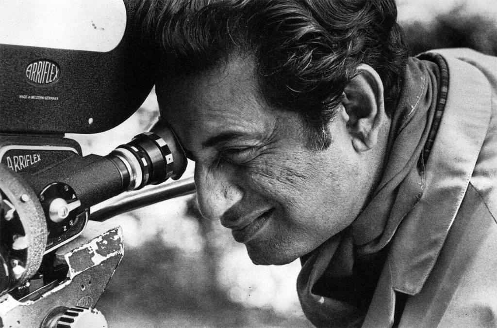


    

        <figure>
            
            <figcaption>Satyajit Ray. &copy; Nemai Ghosh</figcaption>
        </figure>
    



Satyajit Ray was born on May 2, 1921. The upcoming year we will be celebrating his 100th birthday. He is best known throughout the world as "the greatest film maker of all time". The Bengali Maestro directed many films throughout his life which has influenced many filmmakers all over the world. His first film "Pather Panchali", the first movie of the "Apu Triology" is still regarded as one of the best films ever created.

> "Never having seen a Satyajit Ray film is like never having seen the Sun or the Moon" -Akira Kurosawa

Stayjit Ray was inspired into film making by Vittorio De Sica's Italian neorealist film "Bicycle Thieves" while he was working for an advertising agency in London. While working in London, Ray watched 99 films and had made his mind for becoming a filmmaker. After returning back to India, Ray decided to make first film on Bibhutibhushan Bandyopadhyay's novel "Pather Panchali". While making his first film Ray faced many difficulties, he was repeatedly denied by the producers until Ray decided to make the film with his own money. But soon realised that the amount he had with him was not enough to make a film. He then again approached the producers, this time also they denied him or asked him to change how the film ends. At last Ray approached Government of West Bengal for a loan, who also asked him to modify his script and incorporate a happy ending but Ray denied, ultimately Government of West Bengal provided Ray with the loan. Ray then completed his first film which took him an unusual amount of time of two and a half years for shooting of a film, which we today know as one of the best films ever directed on the planet. "Pather Panchali" was finally released in 1955. It went onto win many international awards from all over the world including the award for The best Human Documentary in 1956 Cannes Film Festival.

> "It is absurd to compare it with any other Indian cinema…. Pather Panchali is pure cinema." -Times of India

Satyajit Ray was hugely inspired from Rabindranath Tagore's works and had said it was because of Tagore, he was acquainted to the Indian and far eastern art.

> "I consider the three years I spent in Santiniketan as the most fruitful of my life …. Santiniketan opened my eyes for the first time to the splendours of Indian and Far Eastern art. Until then I was completely under the sway of Western art, music and literature. Santiniketan made me the combined product of East and West that I am." -Satyajit Ray

He was awarded the Honorary Academy Award (Honorary Oscars) as a lifetime achievement award in 1991 by the Academy of Motion Picture Arts and Sciences

> "in recognition of his rare mastery of the art of motion pictures, and of his profound humanitarian outlook, which has had an indelible influence on filmmakers and audiences throughout the world."

Satyajit Ray was awarded Dadasaheb Phalke Award in 1985 and Bahrat Ratna in the year 1992. He was also awarded the highest civilian award from France and Yugoslavia, The Legion of Honour and The Yugoslav Star respectively. His films has inspired many. His influences can be observed in many cinemas from Hollywood to Bollywood.

Although he is well known around the world as "the best filmmaker of all time" but he is also one of the greatest writers of the Bengali Literature and a favourite among the Bengali readers. His characters such as Feluda, a sleuth; Professor Shonku, a scientist; and Tarini Khuro, a traveller; are very popular not only in Bengal but all over India. He was awarded an honorary Doctorate by the Royal College of Arts and a Doctor of Letters form Oxford University for his contributions in literature.

Ray's humanitarian works has showed the world the greatness of Bengali cum Indian Cinema. His humanitarian approach towards parallel cinema has gained praise from all over the world.

Ray said, "He aims to capture both what is unique in the Indian experience and that which is universal."
The Academy Archives started "Satyajit Ray Preservation Project", after the Horary Oscars was awarded to him. Today, the Academy has 18 feature films and one short film of Satyajit Ray digitally archived and has preserved many more so that they are never lost, as they said it will inspire generations after generations of filmmakers to come. The original film roll of "Pather Panchali" was burnt in an accident, but the burnt original film of "Pather Panchali" was kept in a museum by the Academy for directors to get inspiration from. A video explaining how Satyajit Ray's films were restored can be viewed here.

*Originally published at <a href="https://rohandebsarkar.blogspot.com/2020/05/remembering-satyajit-ray-on-his-birth.html">rohandebsarkar.blogspot.com</a> on May 3, 2020.*
