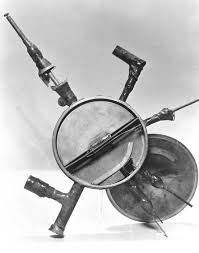
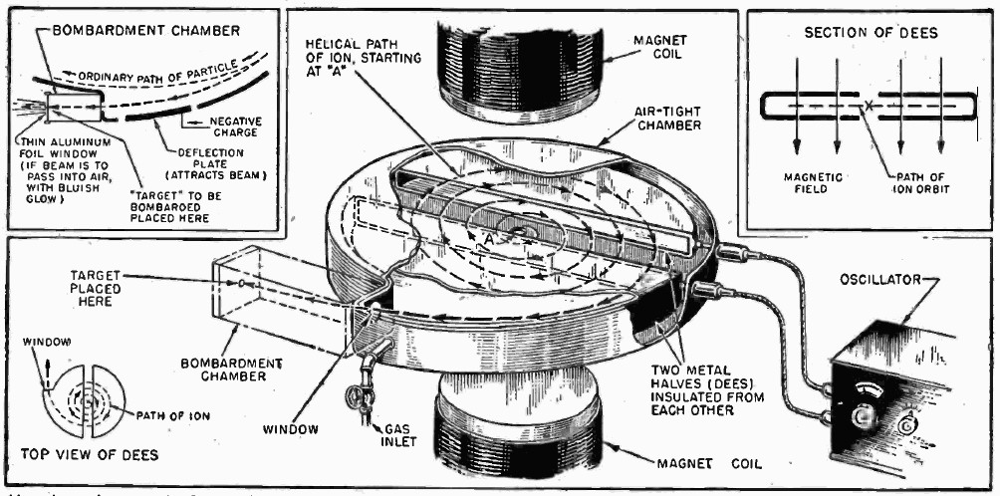
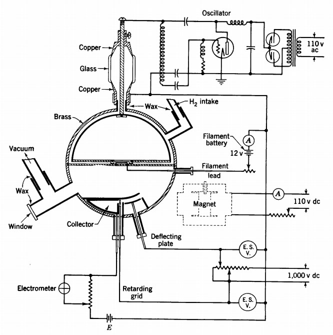
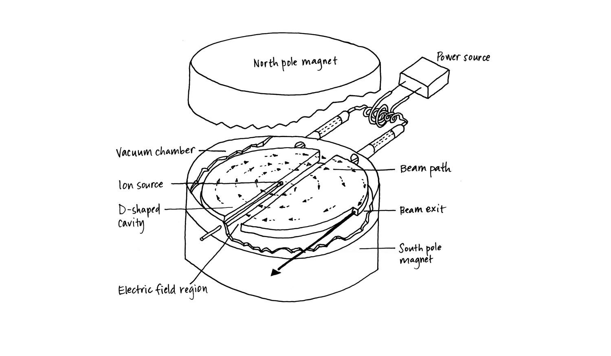
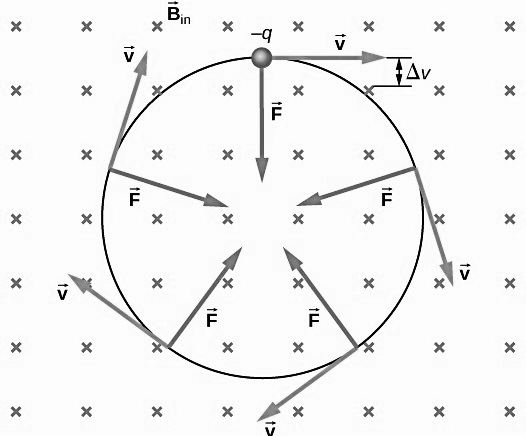
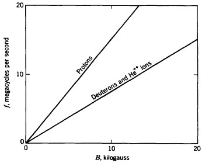
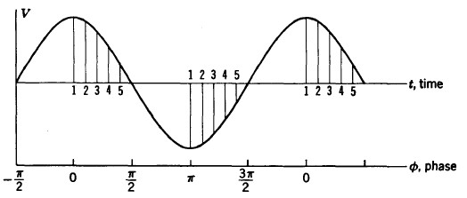


  


Cyclotrons are a classification of particle accelerators. Their principal application
is to set charged particles into high speed motions, which may even be close to
the speed of light and can carry an energy of several billion electron-volts. This
form of high energy motion is achieved by subjecting the charged particles into
electromagnetic fields and thus accelerating them by applying electromagnetic
forces of attraction and repulsion.

Cyclotron is a classification of an electrodynamic particle accelerator. It
accelerates the charged particle outward from the through a spiral trajectory by
subjecting the charged particle into a static magnetic field and repeatedly
accelerates the particle by a rapidly alternating dynamic electric field. The final
energy obtained by the particles are much greater than the impressed voltages
on the electrodes.

Cyclotron was invented by the American scientist Ernest Orlando Lawrence
during the years 1929 and 1930, for which he was awarded The Nobel Prize in
Physics in 1939. The first working model of cyclotron was constructed in 1931
by American physicist Milton Stanley Livingston at the University of California at
Berkeley; it was a 4-inch working model of cyclotron and was able to produce
80,000 eV protons.


  <figure class="l-body">
    
    <figcaption>Fig.1 - The first cyclotron</figcaption>
  </figure>


Cyclotron was a breakthrough in particle physics, as it was able to accelerate
charged particles to a speed that was not possible otherwise. It paved the way
for various researches in fields of physics, chemistry, medical sciences, and in
other scientific subjects. Cyclotron was used for various important scientific
studies such as the discovery of transmutation of atomic nuclei artificially, the
discovery of transuranium elements, research for treating cancer cells, and
many more.

## Particle Accelerators

A particle accelerator is a device that is used to propel charged particles to
extremely high speed and energies using electromagnetic fields, and to contain
them in well-defined beams.

There are two major classifications of particle accelerators:

### Electrostatic particle accelerators

Electrostatic particle accelerators use static electric fields to accelerate
charged particles to high energy speeds. Electrostatic accelerators
accelerate particles by applying static electric potential across the
particle. As the particle comes in the electric field of the applied potential
the particle experiences a force, which results in the acceleration of the
particle.

Some examples of electrostatic particle accelerators:
- Cockcroft-Walton accelerator
- Van de Graaff accelerator

### Electrodynamic particle accelerators

Electrodynamic particle accelerator uses a dynamic electric field to
accelerate charged particles to high energy speeds. These particle
accelerators accelerate particles by subjecting them to oscillating electric
potentials. Electrodynamic accelerators can accelerate particles to higher
energies compared to electrostatic accelerators.

Some examples of electrodynamic particle accelerators:
- Linear accelerators
- Betatron
- Cyclotron

## Cyclotron: A Particle Accelerator

Cyclotron accelerates a charged particle to remarkably high energy without the
use of high voltage, and thus avoiding the limitations of insulation break-down.
The charged particles move in widening semi-circular paths in a uniform
magnetic field, crossing back and forth in a vacuum chamber between two D-
shaped hollow electrodes in resonance with a rapidly oscillatory electric field.
The particles moving in a spiral outward trajectory are accelerated at each
traversal of the electric field, attaining a final energy hundreds of times greater
than that available from the impressed voltage on the electrodes. This principle
of resonance acceleration is termed as "magnetic resonance acceleration" and
the technical name for the device is "magnetic resonance accelerator", which is
concisely termed as "cyclotron".


  <figure class="l-body-outset">
    
    <figcaption>Fig.2 - Construction and working of a cyclotron</figcaption>
  </figure>


The cyclotron principle was proposed in 1930 by Professor Ernest Orlando
Lawrence of the University of California. The original idea of accelerating a
charged particle in an oscillatory electric field was suggested by a experiment
conducted by the Norwegian accelerator physicist Rolf Wideröe in 1928 in which
ions of sodium and potassium were accelerated to twice the applied voltage in
traversing two tubular electrodes in line between which an oscillatory electric
field was applied. The conception of the idea of cyclotron occurred to Lawrence
in the library of the University of California in the summer of 1929, when
professor Lawrence was browsing through the current journals and read Wideröe’s paper
in "Archiv für Elektrotechnik". The principle of the acceleration in a cyclotron was
announced in a short article by professor Lawrence and his graduate student Edlefsen in
1930\. Edlefsen, on professor Lawrence’s request, attempted a brief preliminary
experimental test of the principle but the experiment was not successful in
demonstrating resonance and therefore no experimental results could be
reported. Later, professor Lawrence suggested this problem to Livingston, a
graduate student at Berkeley, as the subject for an experimental research
investigation to demonstrate the validity of the resonance principle. A doctorate
thesis by Livingston dated April 14, 1931 reported the results of the experiment.
This was the first experimental verification of the principle of cyclotron
resonance. For this preliminary study only small-sized laboratory equipment was
available, including an electromagnet of 4 inches pole diameter. An illustration 
from the thesis shows the arrangement of the components.


  <figure class="l-body">
    
    <figcaption>Fig.3 - Illustration of the working of one of the first cyclotrons</figcaption>
  </figure>


## Basic Principles of Working of a Cyclotron

### Static magnetic field

The static magnetic field is produced by a pair of magnets preferably
electromagnets. These magnets are aligned horizontally with a specific
amount of distance between them which is crucial for the cyclotron to
work. It is preferred that the magnets are adjusted in such a manner that
the magnetic field produced by the magnets be as uniform as possible.
The uniform magnetic field keeps the charged particle or ion in a spiral
path while travelling between the hollow D-shaped electrodes. The
magnetic field is directed perpendicular to the electric field as a result the
ion experiences a Lorentz force perpendicular to the radius of the spiral
path and therefore moves in a circular path.

### Dynamic electric field

The dynamic electric field is implemented using a radio frequency
generator which induces an alternating current across the pair of hollow
metallic D-shaped electrodes. The frequency of the alternating current is
adjusted depending on the frequency of the rotation of the ion inside the
D-shaped electrodes. The frequency is very important for the ions to
attain maximum energy in the minimum number of turns and is thus
called the frequency of that cyclotron. When the electrons travel through
the diametral gap between the electrodes, they experience an
electrostatic force and thus attain a higher energy. An alternating radio
frequency is required to change the direction of the electric field after
every half-rotation of the ion across the electrodes. After attaining a
higher energy, the ion rotates with a larger radius. This dynamic electric
field powers the resonance principle which is the driving power behind
the working of a cyclotron.

## Construction of A Cyclotron

A basic cyclotron works by accelerating charged particles in a spiral path inside
the cyclotron inside a pair of electrodes. The electrodes are a pair of hollow
semi-circular flat metallic cylinders in the shape of a capital "D" and are thus
called "dees". The charged particles or ions revolve in order to attain a high
energy state even with a much lower applied voltage. These dees are so
constructed that it is possible to evacuate the air from them during operation as
the collisions of the bombarding particles with air molecules greatly decreases
the energy of the particles. The electrodes are connected to a radio frequency
generator and are placed in a nearly uniform magnetic field. Charged particles
are produced by an ion source directly in the centre of the cyclotron between
the two electrodes. The dees are located between the poles of electromagnet.
The alternating current field applied by the magnet causes the charged ions to
revolve inside the dees with increasing velocity and kinetic energy. These dees
are connected to a radio frequency generator and are placed in a nearly uniform
magnetic field. The magnetic field causes the particle to move in the median
plane in approximately circular orbits inside the hollow electrodes and across
the gap between them. At each gap, particles are accelerated and, therefore,
they follow a spiral path as they gain energy.

Cyclotron magnets are classically simple in their design features. Most
preferably electromagnets are used for their ability of fine tuning the required
magnetic field. The magnets are aligned horizontally perpendicular to the
electric field. This arrangement powers the resonance principle which is the
main principle behind the working of a cyclotron, keeping the charged particle
inside the electrodes traveling in a spiral circular path. This helps in accelerating
the ion multiple times without requiring large sized particle accelerators.

The D-shaped electrodes are kept in a chamber, which fits between the poles of
the electromagnet. The chamber must be vacuum-tight, which is necessary since
without the vacuum the ions will experience resistance from the air molecules
when travelling at high velocities, and the chamber is mechanically designed
with adequate structural strength to resist distortion when under vacuum. It is
constructed of non-magnetic materials to prevent disturbance of the
symmetrical magnetic field and are of high electrical conductivity to provide low
resistance for the radio frequency currents.


  <figure class="l-body-outset">
    
    <figcaption>Fig.4 - Construction of a cyclotron</figcaption>
  </figure>


## Explanation of Working of a Cyclotron

There are two forces behind the working of a cyclotron: the dynamic electric
field and the static magnetic field. The electric field is provided by the two hollow
D-shaped electrodes separated by a diametral gap inside the vacuum chamber,
while the magnetic field is produced by the two powerful magnets (preferably
electromagnets) located above and below the hollow electrodes. This whole
setup is enclosed in a tightly packed vacuum chamber to avoid any loss of energy
arising from the friction provided by air resistance.

This arrangement of the hollow electrodes and the magnets inside the vacuum
chamber provides the cyclotron with the characteristic resonance principle. The
north pole of the magnet is placed above the electrodes and the south pole is
placed below them, therefore the net magnetic field acts across the electrode
in the downwards direction. While the electric field acts from the positive
electrode to the negative electrode in the region of the diametral gap (since,
there is no electric field inside a conductor). The polarity of the electrodes as
well as the direction of the electric field changes back and forth due to the
alternating current applied to the electrodes.

The charged particle or the ion which is to be accelerated is ejected near the
centre of the vacuum chamber between the electrodes in the region of the
diametral gap. As soon as the ion is ejected it is attracted by the oppositely
charged electrode at that instant due to the electrostatic forces. The ion
accelerates and enters the electrode. The region inside the D-shaped electrode
being electric-field-free zone, the ions are not accelerated but are acted upon
only by a near uniform magnetic field which forces it to travel in circular orbits
in a plane normal to the magnetic field.

The magnetic field drives the ions to be in a circular path due to the Lorentz
force applied due to the presence of the magnetic field and the charge on the
ions. The Lorentz force is applied perpendicular to the radius of rotation of the
particle as a result the particle moves in a circular path.

After traversing a semi-circular path, the ions return to the diametral gap
between the electrodes and come in the influence of the electric field. For the
condition of resonance, the magnetic field is adjusted so the time required for
ions to complete a semicircle is equal to the time for reversal of the oscillatory
electric field. Therefore, after traversing the first semi-circle the ion experiences
another acceleration due to the electrostatic forces, acquiring a higher velocity,
and goes onto travel a path of larger radius within the other electrode. As long
as the resonance is maintained, the ions are accelerated each time it crosses the
diametral gap, travelling in ever-widening semicircles until it reaches the
periphery of the electrodes and gets ejected out of the cyclotron with an
enormous energy.

The frequency of the alternating current is very crucial for the charged particles
to be in complete phase so that they can attain very high energies with the
minimum number of turns. If the frequency of the cyclotron is not fine-tuned
for the ion to be in phase the efficiency of the cyclotron decreases drastically.


  <figure class="l-body">
    
    <figcaption>Fig.5 - Vector diagram of the forces acting inside the cyclotron on an electron</figcaption>
  </figure>


## Mathematical Explanation of Working of a Cyclotron

### Magnetic Field of a cyclotron

The magnetic field provides the Lorentz force on the ions, which is
equivalent to,

$$\vec{F}=q(\vec{v}\times\vec{B})$$

where,\
$\vec{F}$ represents the magnetic force on the ion;\
$q$ represents the charge on the ion;\
$\vec{v}$ represents the velocity of the ion;\
$\vec{B}$ represents the magnetic field of the cyclotron.

Because the direction of the force is the cross product between the
velocity of the particle and the magnetic field, the Lorentz force is
perpendicular to both. Since the accelerated ions travel in a plane normal
to the magnetic field, the magnitude of the Lorentz force is,

$$F=qvB$$

This magnetic force causes the ion to travel in a circular path, if $m$ is the
mass of the ion and $r$ is the radius of the circular orbit. Then the centripetal
force acting on the ion is,

$$F=\frac{mv^2}{r}$$

Comparing the centripetal force with the Lorentz magnetic force, we get,

$$qvB=\frac{mv^2}{r}$$

### Electric Field of a cyclotron

The oscillating electric field supplies the force to accelerate the particles
to high velocities. As the ions travel in a circular path in a magnetic field,
they will cross the gap between the two D-shaped electrodes twice in a
revolution, each time receiving an electrostatic force accelerating them to
a higher energy.

The force acting on the particles with charge $q$ and electric field $E$ is,

$$\vec{F_E}=q\vec{E}$$

### Frequency of a cyclotron

The frequency of revolution $f$ of the ion in the circular path is,

$$f=\frac{v}{2\pi r}=\frac{qB}{2\pi m}$$

This frequency $f$ is thus constant for a uniform electric field $B$ as long as
the mass $m$ and charge $q$ of the ion is constant. Thus, the relation
between $f$ and $B$ becomes,

$$f=\left(\frac{1}{2\pi}\times \frac{q}{m}\right)\times B$$

This linear relation between applied frequency and magnetic field is the
fundamental equation of cyclotron resonance. When evaluated for the
$q/m$ values characteristic of light ions, we get

| Ions                              | $f$(megacycles)     |
|:---------------------------------:|:---------------------:|
| protons ($H^+$)                 | $1.52B$             |
| deuterons ($D^+$)               | $0.76B$             |
| $\alpha$-particle ($He^{++}$) | $0.76B$             |

The above relations are plotted in graph to illustrate the range of frequencies required to produce resonant acceleration in magnetic fields
up to 20 kilogauss.

<figure class="l-body">
  
  <figcaption>Graph 1 - Demonstrating variation of frequency between various charged particles</figcaption>
</figure>

### Velocity of an ion in a cyclotron

Comparing the centripetal force with the Lorentz force, we get,

$$\frac{mv^2}{r}=qvB$$

$$\implies v^2 = qvB \times \frac{r}{m}$$

$$\implies v=\sqrt{qvB \times \frac{r}{m}}$$

### Energy of an ion in a cyclotron

Considering the average potential difference between the two D-shaped
electrodes be $V$. The increment in the kinetic energy ($\Delta E_K$) for each
traversal through the diametral gap would be,

$$\Delta E_K = qV$$

Considering the ion accelerates $n$ times by passing through the diametral
gap, the total kinetic energy ($E_K$) processed by the ion during the final
rotation would be,

$$E_K = n \times qV$$

But, $$n=\left(\frac{f}{2}\right)$$

$$E_K =  \left(\frac{f}{2}\right) \times qV$$

Considering the velocity of the ion during the final rotation be $v$, the total
kinetic energy ($E_K$) processed by the ion would be,

$$E_K = n \times qV = \frac{1}{2}mv^2$$

Therefore, the output kinetic energy of the particles expressed in terms
of the magnetic field $B$ and final orbit radius $R$,

$$E_K = \frac{q^2B^2R^2}{2m}$$

Expressing the kinetic energy per unit charge,

$$\frac{E_K}{q} = \frac{1}{2}\frac{q}{m}B^2R^2$$

### Voltage-Time relation of a cyclotron

A voltage-time graph of the potential between the electrodes of a
cyclotron is shown in the graph. On each traversal of the diametral gap
between electrodes the particle will acquire an increment of kinetic
energy, $\Delta E_K = qV$, where $V$ is the potential difference between the two
electrodes. The magnitude of the increment is determined by the phase
of crossing the gap. Since, the particles will be moving in opposite
directions in successive passages through the diametral gap, so the kinetic
energy increments are cumulative. Distinct phases of resonance are
plotted on the graph ($points - 1, 2, 3, 4 ...$), a resonant particle crossing
at the phase of peak field ($point - 1$) will reach maximum energy in the
minimum number of turns. While the ions crossing at other phases
($points - 2, 3, 4 ...$), will acquire energy in smaller increments but will
remain in resonance for a larger number of turns to reach the maximum
energy.


  <figure class="l-body">
    
    <figcaption class="caption">Graph 2 - Voltage-time relation of a cyclotron</figcaption>
  </figure>


## Advantages of Cyclotrons

Cyclotron was a huge improvement over the previous generation particle
accelerators for several reasons:

- Cyclotron uses the resonance principle for accelerating the charged
  particles. For this reason, it was a huge cost-effective option as it could
  make use of the same electric field again and again to accelerate the
  particle into high energies instead of accelerating the particle in a straight
  line through a evacuated tube.
- It was also a very good space effective option as it did not require large
  space as required by the linear accelerators.
- With cyclotrons it was for the first time possible to attain particles with
  tremendous high energies by only applying a small potential difference
  across the electrodes.
- It provided a compact design for particle accelerators by accelerating the
  particle in a spiral path. Before cyclotrons, particle accelerators were very
  bulky and inefficient.

## Limitations of Cyclotrons

When professor Lawrence invented the cyclotron, he did not consider the
relativistic consequences. He assumed the spiral path of the particle inside the
cyclotron was in accordance with Newton's laws of motion. If the particles
acquire enough energy so to become sufficiently fast that the relativistic effects
become more important then the desired results are not obtained.
At high velocities, the mass of the particle increases according to the given
formula,

$$m=\frac{m_0}{\sqrt{1-\frac{v^2}{c^2}}}$$

where,\
$m$ represents the mass of the particle at the instant when velocity is $v$;\
$m_0$ represents the rest mass of the particle;\
$c$ represents the speed of light.

This change in mass largely affects the performance of the cyclotron.
Apart from the relativistic consequences, cyclotrons are also unable to
accelerate electrons because they have very low mass and get energised rapidly.
The velocity of the cyclotron increases to such a great extent that the electron
will be thrown out of the step with the oscillating field.

## Modifications of Cyclotron

In order to correct the relativistic limitations of a cyclotron some adjustments
are made to the original design of the cyclotron by Professor Lawrence. The
following are some special types of cyclotron classified based on the
adjustments made to the original design.

The adjustments were made using the adjustment factor $\gamma$,

$$\gamma = \frac{1}{\sqrt{1-\frac{v^2}{c^2}}}$$

### Synchrocyclotron

Instead of a constant frequency in an original cyclotron, the frequency of
the RF electric field in a synchrocyclotron is varied to compensate for the
relativistic effects on the mass of the particles as its velocity approaches
the speed of light.

The frequency is adjusted using the following equation,

$$f=\frac{f_0}{\gamma}$$

where,\
$f$ represents the frequency of the synchrocyclotron;\
$f_0$ represents the frequency of the non-adjusted cyclotron;\
$\gamma$ represents the Lorentz factor.

### Isochronous cyclotron

Isochronous cyclotron is an alternative to the synchrocyclotron, in this
design the magnetic field increases with the radius. Isochronous
cyclotrons can produce particles with much greater velocity compared to
synchrocyclotrons.

The magnetic field is adjusted using the following equation,

$$B=\gamma B_0$$

where,\
$B$ represents the magnetic field of the isochronous cyclotron;\
$B_0$ represents the magnetic field of the non-adjusted cyclotron;\
$\gamma$ represents the Lorentz factor.

## Conclusion

Cyclotron was invented in 1930 by Ernest Orlando Lawrence. It revolutionised
the way particle accelerators worked. It provided a very efficient design for
accelerating charged particles to very high speeds with a fraction of voltage
applied across electrodes. The circular design of the cyclotron made it very
compact. Cyclotrons are preferred over other cyclotrons for its efficiency.

Before cyclotrons, charged particles were accelerated mostly using linear
particle accelerators. Linear particle accelerators used multiple electric fields to
accelerate the particles making the design very bulky. Cyclotron solved this
problem by giving a compact circular design which was able to accelerate
particles to high velocity by accelerating them in the same electric field
repeatedly.

The cyclotron resonance principle worked with the help of a static magnetic field
and an alternating electric field. The static magnetic field keeps the charged
particle in its orbit inside the electrodes, whereas the alternating current across
the electrodes is used to accelerate the particles by revolving them in a spiral
trajectory of increasing radius. The particle keeps on gaining energy and
therefore increases its radius every time there is an increase in its velocity.
Ultimately when the radius of its trajectory becomes equal to the radius of the
cyclotron it is ejected as a beam of very high current.

Though cyclotron was a huge improvement over its predecessors, it still had
some drawbacks. The design of cyclotron did not consider the relativistic effects
of high velocity in the mass of the particles. Therefore, later some adjustments
were made to cancel the relativistic effects.

Cyclotron paved a way for a new generation of particle accelerators. It solved
many problems associated with previous accelerators. It revolutionised the way
particle accelerators worked by putting forward the resonance principle.

***

## Bibliography

- Livingston, M. Stanley, and John P. Blewett. "Particle Accelerators Mc Graw-Hill Book Company." INC, NY (1962).

- Lawrence, Ernest O. "Method and apparatus for the acceleration of ions." U.S. Patent No. 1,948,384. 20 Feb. 1934.

- Lawrence, Ernest O. "The evolution of the cyclotron." Nobel Lecture (1951).

- Lawrence, Ernest O., and M. Stanley Livingston. "The production of high speed light ions without the use of high voltages." Physical Review 40.1 (1932): 19.

- Sayre, Joseph G. "The Cyclotron." Ohio State Engineer, vol. 26, no. 5 (April, 1943), 11-12, 18.
